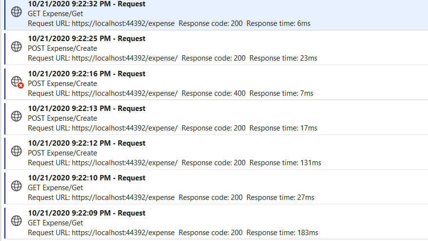

# Expense tracker

## How do I use it?

### The API:
Navigate to ExpenseTracker.Api and execute
```
dotnet run
```
If ports 5000 and 5001 are free, you can query it at `localhost:5001/expenses`

### The Frontend:
In another terminal, navigate to `ExpenseTracker.Api/expense-tracker` and execute
```
npm install
```
and 
```
npm start
```

If port 4200 is free, you can navigate to localhost:4200 in your browser and see this:


## If I had more time...
I would 
- Test more! Not much in terms of logic for the API, but more for the frontend app. 
- Docker-compose, it's rather awkward to set up the app now. I'd create a container each for the frontend app, the api and the db like I do in my other project here: https://github.com/fhammerl/polls
- Configuration: I have a lot of hardcoded configs I'm not proud of, would have to get rid of them anyway to dockerize the system
- Performance:   
  - Think about performance more when I have some use cases
- Refactorings: 
  - Probably a multi layer architecture for the API (Api, Core, Services and Data)
  - Add some sort of linting / auto formatter
  - Not a fan of raw injecting the DbContext in particular, a service layer would be nice
- Actually use ExpenseType (food, drink, other)
- Validation server side - at least for stuff like currency -> currencyEnum
- Support my App Insights logging with some events perhaps?


## Technology choices
### Visual Studio Code + Remote Development / Dev Containers
With VS Code Remote Development, you can use a Docker container as a full-featured development environment. VS Code is going to work **as if it was running locally on the Linux container.** Other tools offer similar solutions of course (mounting the workspace, hot-reload), but I find the extreme approach of hooking the entire "IDE" into a container quite inspiring. 

To open the dev container:
- Open the folder in VS Code
- Reopen in container (popup in bottom right of the window)
- Hit F5 to start the API
- Note that the container is not setup to run the frontend app (yet!)

More about dev containers: https://stuartleeks.com/posts/vscode-devcontainers/

### Sqlite
I wanted a db that you could plug and play without actually having to install an external DB or have a container running your DB server, Sqlite was perfect for this. 
With more time, I'd probably use docker-compose to include my devcontainer and a standalone db instance in a network.
***
  
## What I'd do differently

- Less time on the frontend
- Not forget about adding the user_id to the 
